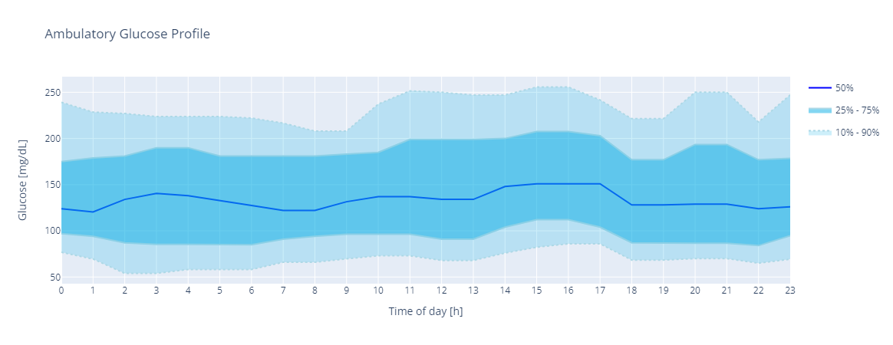
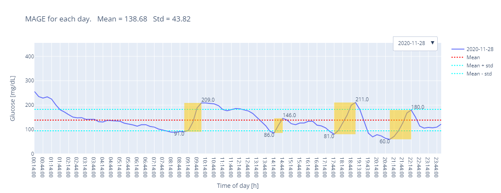

# GlucoPy
Python Toolbox for glycaemic signal processing

## Table of Contents
- [GlucoPy](#glucopy)
  - [Table of Contents](#table-of-contents)
  - [Main Features](#main-features)
  - [Dependencies](#dependencies)
  - [Installation from source](#installation-from-source)
  - [Documentation](#documentation)
  - [Examples](#examples)
    - [Create a `Gframe` object from a .csv file](#create-a-gframe-object-from-a-csv-file)
    - [Create a `Gframe` object from a .xslx file](#create-a-gframe-object-from-a-xslx-file)
    - [Create a `Gframe` object from a pandas `DataFrame`](#create-a-gframe-object-from-a-pandas-dataframe)
    - [Create a `Gframe` object from Glucopy's datasets](#create-a-gframe-object-from-glucopys-datasets)
    - [Calculate some metrics](#calculate-some-metrics)
    - [Plots](#plots)
      - [Ambulatory Glucose Profile (AGP)](#ambulatory-glucose-profile-agp)
      - [Frequency Histogram](#frequency-histogram)
      - [MAGE Plot](#mage-plot)
  - [Collection of Python Signal Processing Library Repositories](#collection-of-python-signal-processing-library-repositories)
  - [Public Datasets](#public-datasets)
  
## Main Features
- Importing and exporting CGM signals in formats: **.csv**, **.xslx**, **.xls**
- Glycaemic signal in units: **mg/dL (default)**, **mmol/L**
- Calculation of metrics like **Mean**, **MODD**, **TIR**, **MAGE**, **BGI**, **Q-Score**, etc.
- Automatic summary of the metrics.
- Generate Plots for analysis and visualization of the entire data or separated by day, some examples are **Box Plot**, **Frequency Histogram**, **Trace Plot**, **Ambulatory Glucose Profile (AGP)**, etc.
- Very easy to use all metrics are calculated calling a method of the class `Gframe`, and the plots are generated using that same class.

## Dependencies
- [Pandas](https://pandas.pydata.org/)
- [Numpy](https://numpy.org/)
- [Plotly](https://plotly.com/python/)
- [Scipy](https://www.scipy.org/)
- [NeuroKit2](https://neuropsychology.github.io/NeuroKit/)
- [Astropy](https://www.astropy.org/)
- [Requests (NeuroKit2 dependency)](https://docs.python-requests.org/en/master/)

## Installation from source 
In the GlucoPy directory (same one where you found this file after cloning the repository), run:

```bash
pip install .
```

## Documentation
The official documentation is hosted on [github.io/GlucoPy/](deigoodle.github.io/GlucoPy/)

## Examples
All the **Metrics** are implemented as methods in the `glucopy.Gframe` class

### Create a `Gframe` object from a .csv file
```python
import glucopy as gp

# Read the file
gf = gp.read_csv('path/to/file.csv')
```

### Create a `Gframe` object from a .xslx file
```python
# Read the file
gf = gp.read_xlsx('path/to/file.xlsx')
```

### Create a `Gframe` object from a pandas `DataFrame`
```python
import pandas as pd

# Create a DataFrame
df = pd.read_csv('path/to/file.csv')

gf = gp.Gframe(df)
```

### Create a `Gframe` object from Glucopy's datasets
```python
# Import the dataset
gf = gp.data("prueba_1")
```

### Calculate some metrics

Check the [documentation of Gframe](https://deigoodle.github.io/GlucoPy/glucopy.Gframe.html) for a complete list of metrics
```python
# Mean
mean = gf.mean()

# MODD
modd = gf.modd()

# TIR
tir = gf.tir()

# MAGE
mage = gf.mage()

# BGI
lbgi = gf.lbgi()
hbgi = gf.hbgi()
```
### Plots

All the plots use a `Gframe` object as first parameter. Check the [documentation of glucopy.plot](https://deigoodle.github.io/GlucoPy/glucopy.plot.html) for a complete list of plots

#### Ambulatory Glucose Profile (AGP)

```python
gp.plot.agp(gf)
```


#### Frequency Histogram

```python
gp.plot.freq(gf)
```


#### MAGE Plot

```python
gp.plot.mage(gf)
```


## Collection of Python Signal Processing Library Repositories

- [PyRadiomics](https://github.com/AIM-Harvard/pyradiomics/tree/master)
- [StatsModels](https://github.com/statsmodels/statsmodels/)
- [BioSPPy - Biosignal Processing in Python](https://github.com/PIA-Group/BioSPPy)
- [Type-2-Diabetes-Prediction-Using-Short-PPG-Signals-and-Physiological-Characteristics](https://github.com/chirathyh/clardia---Type-2-Diabetes-Prediction-Using-Short-PPG-Signals-and-Physiological-Characteristics-)
- [splearn: Python Signal Processing](https://github.com/jinglescode/python-signal-processing)
- [spm1d: One-Dimensional Statistical Parametric Mapping in Python and MATLAB](https://github.com/0todd0000/spm1d/)
- [NeuroKit2: The Python Toolbox for Neurophysiological Signal Processing](https://github.com/neuropsychology/NeuroKit)
- [PyGSP: Graph Signal Processing in Python](https://github.com/epfl-lts2/pygsp)
- [rGV — Analysis of Continuous Glucose Monitor Data](https://github.com/cran/rGV)

## Public Datasets

- [Awesome-CGM](https://github.com/irinagain/Awesome-CGM)

  This is a collection of links to publicly available continuous glucose monitoring (CGM) data.

- [OhioT1DM](http://smarthealth.cs.ohio.edu/OhioT1DM-dataset.html)

  The OhioT1DM dataset is available to researchers interested in improving the health and wellbeing of people with type 1 diabetes. It contains 8 weeks worth of data for each of 12 people with type 1 diabetes. a Data Use Agreement (DUA) is required.

- [ShanghaiT1DM and ShanghaiT2DM](https://www.nature.com/articles/s41597-023-01940-7#ref-CR40)
  
  ShanghaiT1DM and ShanghaiT2DM are publicly available Datasets for research purposes, they contain Type 1 (n = 12) and Type 2 (n = 100) diabetic patients in Shanghai, China.

- [CG Map](https://github.com/ayya-keshet/CGMap)

  A reference resource for characterization of CGM data collected from more than 7,000 non-diabetic individuals, aged 40-70 years.


